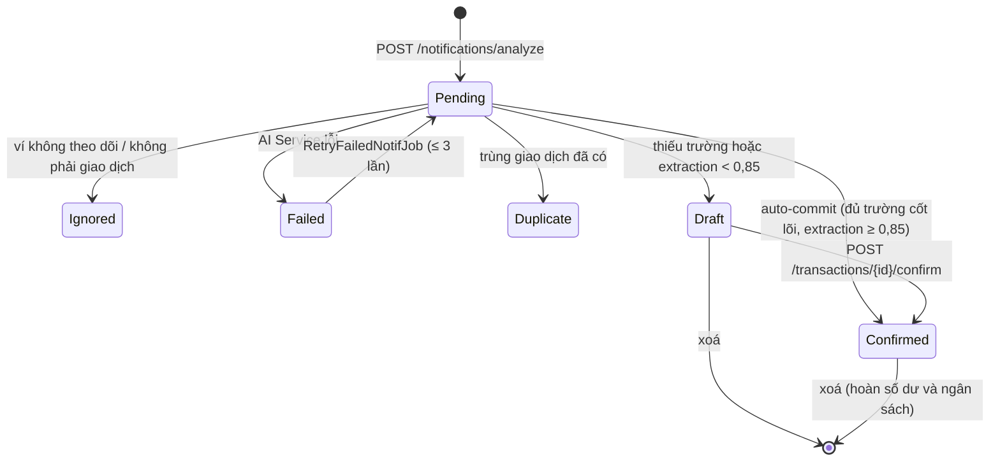
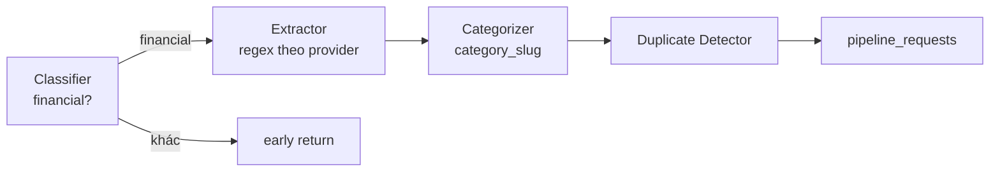

# FinMate — Đặc tả yêu cầu chức năng & phi chức năng

Cập nhật: 2026-09-24 · Bản sống (sửa, comment): https://claude.ai/code/artifact/a3155967-6d9e-4d91-aff5-07f16d5e0ac1

## 1. Giới thiệu

Tài liệu này liệt kê các yêu cầu chức năng (FR) và phi chức năng (NFR) mà phía server của FinMate phải đáp ứng. Nguồn nghiệp vụ là tài liệu **"FinMate — Đặc tả chi tiết các Core User Flows"** (bản hiện hành: 3 Core Flow và Admin Flow ở vai trò hỗ trợ). Phần mô tả hành vi hiện có được viết lại từ hệ thống đang chạy (Phase 1–18). Mỗi yêu cầu có mã riêng, mức ưu tiên và tiêu chí kiểm chứng được.

**Phạm vi.** Hai dịch vụ: Backend ASP.NET Core 9 (REST `/api/v1`, PostgreSQL, Redis, Hangfire) và AI Service FastAPI Python 3.11 (CSDL `finmate_ai` riêng). Ứng dụng Android (`android/`) nằm ngoài phạm vi. Nó chỉ được nhắc tới ở vai trò client; các yêu cầu đặc tả giao cho app được gom ở mục 2.3 để truy vết.

**Quy ước mã.** `FR-<NHÓM>-<số>` cho chức năng, `NFR-<NHÓM>-<số>` cho phi chức năng. Nhóm: AUTH, ACC, CAT, TXN, BUD, GOAL, RPT, NOTI, GAME, AI, ADM; SEC, DATA, REL, PERF, OPS, MNT, USE.

**Nhãn đối chiếu với đặc tả.** Yêu cầu không mang nhãn là hệ thống đã đáp ứng.

| Nhãn | Ý nghĩa |
| --- | --- |
| **[Mới]** | Đặc tả yêu cầu, hệ thống chưa có |
| **[Đổi]** | Đặc tả quy định hành vi khác với hệ thống đang chạy |
| **[Một phần]** | Hệ thống có một phần, còn thiếu so với đặc tả |

Toàn bộ các mục mang nhãn được tổng hợp ở mục 13.1.

**Mức ưu tiên** (MoSCoW):

| Mức | Ý nghĩa |
| --- | --- |
| Must | Thiếu thì sản phẩm không phát hành được hoặc gây mất tiền / lộ dữ liệu |
| Should | Quan trọng, có cách vòng tạm thời |
| Could | Cải thiện trải nghiệm, có thể lùi sang bản sau |
| Won't (MVP) | Đã quyết định không làm trong MVP |

## 2. Tác nhân, luồng nghiệp vụ và kênh đầu vào

### 2.1 Tác nhân

Hệ thống có hai tác nhân con người (User, Admin), một tác nhân nội bộ (AI Service), một nguồn sự kiện (Android OS, qua app) và các dịch vụ bên ngoài. Sơ đồ ngữ cảnh: `docs/diagrams/so-do-ngu-canh.html`.

| Tác nhân | Loại | Tương tác với hệ thống |
| --- | --- | --- |
| User | Người dùng cuối qua app Android | Quản lý ví, giao dịch, ngân sách, mục tiêu, báo cáo, nhiệm vụ |
| Admin | Nhân sự vận hành, vai trò `Admin` trong JWT | Admin Flow (hỗ trợ): quản trị người dùng, cấu hình provider và mô hình AI, danh mục hệ thống, nhiệm vụ, audit, AI stats |
| Android OS | Nguồn sự kiện, chuyển qua app | Thông báo biến động số dư từ app ngân hàng / ví mà user đã chọn theo dõi. FinMate **không** kết nối tài khoản ngân hàng |
| AI Service | Dịch vụ nội bộ, gọi bằng `INTERNAL_API_KEY` | Phân tích thông báo, OCR hoá đơn, nhận phản hồi, báo thống kê mô hình |
| Google | OAuth 2.0 / OpenID Connect | Đăng nhập bằng ID token (native) hoặc qua trình duyệt trong app |
| Firebase Cloud Messaging | Push | Gửi thông báo tới thiết bị đã đăng ký |
| Brevo | Email giao dịch | Gửi mã OTP xác minh email và đặt lại mật khẩu |
| Hangfire scheduler | Tác nhân thời gian | Chạy 8 job định kỳ (cảnh báo, streak, tổng hợp, dọn dữ liệu…) |

### 2.2 Ba Core Flow

| Core Flow | Kích hoạt | Mục yêu cầu |
| --- | --- | --- |
| Flow 1 — Ghi nhận tự động từ thông báo | Android hiển thị thông báo biến động số dư từ app được chọn | 5.1, 8 |
| Flow 2 — Ghi nhận chi tiêu tiền mặt đa kênh | User chạm "Thêm giao dịch" | 5.2 |
| Flow 3 — Quản lý & phân tích tài chính cùng AI | Lưu cấu hình ngân sách / ngưỡng, giao dịch chi mới, nạp mục tiêu, mở tab Báo cáo, lịch dự báo hằng ngày | 6 |
| Admin Flow (hỗ trợ) | Quản trị viên thao tác | 9 |

**Bốn kênh nhập giao dịch** — giá trị ghi vào `transactions.source`:

| Kênh | Core Flow | Đường vào server | Ai tạo giá trị tiền |
| --- | --- | --- | --- |
| Thông báo ngân hàng / ví | Flow 1 | `POST /notifications/analyze` | Regex theo provider (AI Service) |
| Gõ ngôn ngữ tự nhiên | Flow 2 | `POST /transactions/parse` | Parser số tiền ("75k", "1.5tr") |
| Giọng nói | Flow 2 | `POST /transactions/parse` (client đã speech-to-text) | Parser số bằng chữ tiếng Việt có dấu |
| Ảnh hoá đơn | Flow 2 | OCR Tesseract qua AI Service | OCR + trích xuất, luôn cần người dùng rà soát |

Kênh thứ tư của Flow 2 là form nhập tay qua `POST /transactions`. Đây cũng là đường dự phòng khi thiết bị mất mạng. Chuyển khoản nội bộ đi qua `POST /transactions/transfer`.

### 2.3 Yêu cầu đặc tả giao cho app (ngoài phạm vi server)

Ghi lại để truy vết; server không kiểm soát các phần này nhưng phải chịu được hệ quả của chúng.

| Đặc tả | Yêu cầu phía app | Hệ quả với server |
| --- | --- | --- |
| Flow 1, bước 1.3–1.4 | Hướng dẫn bật thông báo ngân hàng và cấp quyền Notification Access; thiếu quyền thì tắt Flow 1, các tính năng khác vẫn chạy | Không có |
| Flow 1, bước 2.2 | Heartbeat kiểm tra `NotificationListenerService`; hướng dẫn Auto-start / whitelist khi bị ROM tắt | Không có |
| Flow 1, bước 3.1 | Lọc 3 tầng trên thiết bị (Package → Keyword/Regex → TFLite); thông báo không thuộc app được chọn, quảng cáo, OTP không rời thiết bị | Classifier phía server vẫn giữ làm lớp phòng vệ thứ hai (FR-AI-01) |
| Flow 1, bước 5.3 | Draft không được phản hồi trước timeout → vào hàng đợi Chờ duyệt | Draft giữ nguyên trạng thái, không ảnh hưởng số dư (FR-TXN-09) |
| Flow 1, bước 6.1 · Flow 2, bước 10 | Lưu vào Room khi mất mạng, đồng bộ khi có mạng | Chống trùng khi đồng bộ (FR-TXN-02, FR-TXN-12, NFR-REL-04) |
| Flow 2, bước 4 | Mất mạng → chuyển sang form (graceful fallback) | Không có |
| Flow 3 | Biểu cảm Mascot, biểu đồ Donut / Line, thẻ Insight, màn ăn mừng | Server cung cấp dữ liệu và trạng thái (mục 6) |

## 3. FR — Xác thực và tài khoản người dùng

Người dùng phải chấp thuận Privacy Policy trước khi tạo tài khoản, đăng ký bằng email/mật khẩu hoặc Google, xác minh email bằng OTP, và có thể tự khôi phục mật khẩu mà không cần đăng nhập.

| Mã | Yêu cầu | Ưu tiên | Tiêu chí chấp nhận |
| --- | --- | --- | --- |
| FR-AUTH-00 | **[Mới]** Ghi nhận chấp thuận Privacy Policy (Flow 1 bước 1.0) | Must | Đăng ký (email hoặc Google lần đầu) không kèm chấp thuận → 400. Lưu phiên bản chính sách và thời điểm chấp thuận theo user; chính sách đổi phiên bản thì yêu cầu chấp thuận lại |
| FR-AUTH-01 | Đăng ký bằng email, mật khẩu, tên hiển thị | Must | Email đúng định dạng, ≤ 320 ký tự, chưa tồn tại; mật khẩu ≥ 8 ký tự; tên ≤ 200 ký tự. Gửi OTP xác minh sau khi tạo |
| FR-AUTH-02 | Xác minh email bằng OTP 6 chữ số (`verify-email`, `resend-verification`) | Must | Mã hết hạn sau 10 phút, dùng một lần, bị huỷ sau 5 lần sai; gửi lại cách nhau ≥ 60 giây. Khi `REQUIRE_EMAIL_VERIFICATION` bật, chưa xác minh thì không đăng nhập được |
| FR-AUTH-03 | Đăng nhập email/mật khẩu | Must | Trả access token JWT (15 phút) + refresh token opaque (30 ngày). Tài khoản bị khoá hoặc đã yêu cầu xoá thì từ chối |
| FR-AUTH-04 | Đăng nhập Google native (`POST /auth/google`, ID token) | Must | Xác minh chữ ký và `aud` = `GOOGLE_CLIENT_ID`; tạo user mới nếu email chưa có, email Google coi như đã xác minh |
| FR-AUTH-05 | Đăng nhập Google qua trình duyệt (`/auth/google/start` → `callback` → `exchange`) | Should | `state` dùng một lần, sống 10 phút; redirect chỉ mang **handoff code** sống 2 phút, đổi được đúng một lần lấy token. Thiếu `GOOGLE_CLIENT_SECRET` → ba endpoint trả 422, route native vẫn chạy |
| FR-AUTH-06 | Làm mới token có xoay vòng (`/auth/refresh`) | Must | Mỗi lần làm mới huỷ token cũ, cấp cặp mới; token đã dùng bị dùng lại → huỷ **tất cả** refresh token của user. Vai trò được đọc lại từ DB |
| FR-AUTH-07 | Đăng xuất một thiết bị / tất cả thiết bị (`logout`, `logout-all`) | Must | Refresh token tương ứng bị thu hồi, dùng lại trả 401 |
| FR-AUTH-08 | Quên mật khẩu (`forgot-password`) | Must | Phản hồi giống hệt từng byte cho email có thật, email không tồn tại và trường hợp đang cooldown |
| FR-AUTH-09 | Đặt lại mật khẩu bằng OTP (`reset-password`) | Must | OTP theo mục đích: mã xác minh email không dùng được để reset. Áp quy tắc mật khẩu như đăng ký; thành công thì thu hồi mọi refresh token |
| FR-AUTH-10 | Đổi mật khẩu khi đã đăng nhập (`change-password`) | Must | Phải đúng mật khẩu cũ; mật khẩu mới ≥ 8 ký tự |
| FR-AUTH-11 | Xem và sửa hồ sơ (`GET/PATCH /users/me`) | Must | Sửa được tên hiển thị và thu nhập dự kiến hàng tháng (`monthly_income_cents`, Flow 1 bước 1.2); cache hồ sơ bị vô hiệu ngay khi sửa |
| FR-AUTH-12 | Cài đặt thông báo (`PATCH /users/me/notification-prefs`) | Must | Bật/tắt push và từng loại cảnh báo; có hiệu lực với mọi đường gửi push (xem FR-NOTI) |
| FR-AUTH-13 | Yêu cầu xoá tài khoản (`DELETE /auth/account`) | Must | User bị xoá mềm ngay, không đăng nhập được nữa; xoá cứng sau 30 ngày bởi `DataDeletionJob` (03:00). Chỉ Admin huỷ được yêu cầu (FR-ADM-07) |
| FR-AUTH-14 | Đăng ký / gỡ thiết bị nhận push (`POST/DELETE /devices`) | Must | Token FCM là duy nhất trên toàn hệ thống: đăng ký dưới tài khoản khác thì **chuyển** chủ, không nhân bản |
| FR-AUTH-15 | Đăng ký bằng SĐT + OTP SMS | Won't (MVP) | Đặc tả bước 1.1 cho phép "Email / Số điện thoại". Quyết định ngày 2026-09-11 vẫn giữ: chỉ email OTP (xem mục 13.3) |

**Onboarding (Flow 1 bước 1.2)** không có endpoint riêng mà ghép từ ba yêu cầu: chọn app theo dõi (FR-ACC-02, FR-ACC-04), nhập thu nhập dự kiến (FR-AUTH-11), đặt ngân sách tháng ban đầu (FR-BUD-01).

## 4. FR — Tài khoản tài chính và danh mục

Mỗi giao dịch thuộc một tài khoản tài chính (ngân hàng, ví điện tử, tiền mặt) và — trừ chuyển khoản — một danh mục hoặc "Chưa phân loại". Không xóa được thứ gì đang có giao dịch trỏ tới.

### 4.1 Tài khoản tài chính

| Mã | Yêu cầu | Ưu tiên | Tiêu chí chấp nhận |
| --- | --- | --- | --- |
| FR-ACC-01 | Liệt kê nhà cung cấp đang hoạt động (`GET /financial-accounts/providers`) | Must | Chỉ trả provider `is_active`; Techcombank, VPBank, ShopeePay bị ẩn cho tới khi `package_name` được kiểm trên thông báo thật |
| FR-ACC-02 | Tạo tài khoản: tên, loại (`Bank`, `EWallet`, `Cash`), số dư ban đầu | Must | Tên 1–100 ký tự; số dư ≥ 0; `Cash` không được có provider, `Bank`/`EWallet` bắt buộc có |
| FR-ACC-03 | Sửa tên tài khoản | Must | Tên 1–100 ký tự |
| FR-ACC-04 | Bật/tắt theo dõi thông báo (`PATCH …/monitoring`) | Must | Đây là danh sách "app được chọn" của đặc tả phía server. Thông báo từ ví đang tắt bị ghi trạng thái `Ignored`, không tạo nháp |
| FR-ACC-05 | Xem số dư (`GET …/{id}/balance`) | Must | Số dư là giá trị cộng dồn cập nhật theo mỗi giao dịch, không tính lại từ lịch sử |
| FR-ACC-06 | Xoá tài khoản | Must | Xoá mềm; còn giao dịch → 409 `HasTransactions` |
| FR-ACC-07 | Mọi thao tác chỉ trên tài khoản của chính user | Must | Tài khoản của người khác trả 404, không phải 403 |

### 4.2 Danh mục

| Mã | Yêu cầu | Ưu tiên | Tiêu chí chấp nhận |
| --- | --- | --- | --- |
| FR-CAT-01 | Liệt kê danh mục = danh mục hệ thống đang hoạt động + danh mục riêng của user | Must | Danh mục hệ thống được cache 60 phút |
| FR-CAT-02 | Tạo / sửa danh mục riêng | Must | Tên 1–100 ký tự, tên icon ≤ 50 ký tự |
| FR-CAT-03 | Xoá danh mục riêng | Must | Xoá mềm; còn giao dịch → 409 `HasTransactions`. User không sửa/xoá được danh mục hệ thống |
| FR-CAT-04 | Danh mục hệ thống được nhận diện bằng `slug` bất biến | Must | `slug` là khoá AI Service trả về (`category_slug`); đổi slug làm gãy liên kết phân loại nên bị cấm |
| FR-CAT-05 | "Chưa phân loại" (Uncategorized) là trạng thái hợp lệ của giao dịch chi/thu | Must | Biểu diễn bằng `category_id` NULL; chỉ tính vào ngân sách tổng, hiện thành dòng "Chưa phân loại" trong cơ cấu chi, user gán danh mục sau được |

## 5. FR — Giao dịch (Core Flow 1 & 2)

Giao dịch từ thông báo được **tự động ghi nhận** khi đủ trường cốt lõi và AI trích xuất đủ chắc chắn; ngược lại nó nằm ở trạng thái `Draft` và không ảnh hưởng số dư, ngân sách, báo cáo cho tới khi được xác nhận. Giao dịch nhập tay được xác nhận ngay.

Vòng đời một thông báo ngân hàng theo đặc tả hiện hành. Hai nhánh `Duplicate` và `Pending → Confirmed` là **[Đổi]**: hệ thống hiện chỉ bỏ qua bản trùng và luôn tạo `Draft`.

### 5.1 Flow 1 — Từ thông báo ngân hàng

| Mã | Yêu cầu | Ưu tiên | Tiêu chí chấp nhận |
| --- | --- | --- | --- |
| FR-TXN-01 | Nhận thông báo từ client (`POST /notifications/analyze`): package, tiêu đề, nội dung, thời điểm nhận | Must | Ghi `notification_logs`, gọi AI Service, trả kết quả giao dịch khi là giao dịch tài chính |
| FR-TXN-02 | Chống trùng khi đồng bộ offline | Must | Khóa chống trùng = `contentHash` (đã gồm `ReceivedAt` làm tròn tới phút), **không** có cửa sổ thời gian; gửi lại sau 5 phút vẫn không sinh bản ghi thứ hai |
| FR-TXN-03 | Thông báo từ ví chưa theo dõi → `Ignored` | Must | `Ignored` chỉ chặn trùng trong 5 phút, để thông báo được đánh giá lại nếu user vừa thêm ví đó |
| FR-TXN-04 | Thử lại khi AI Service lỗi | Should | `RetryFailedNotifJob` mỗi 15 phút, tối đa 3 lần cho mỗi log `Failed` |
| FR-TXN-05 | **[Đổi]** Auto-commit theo trường cốt lõi và độ tin cậy trích xuất (bước 5.2) | Must | Trường cốt lõi = số tiền, chiều giao dịch, thời điểm. Đủ cả ba **và** `extraction_confidence ≥ 0,85` → ghi `Confirmed` ngay, không chờ user; cập nhật số dư, ngân sách, EXP như FR-TXN-07. Thiếu trường hoặc extraction < 0,85 (kể cả null) → giữ `Draft`. Hiện tại: độ tin cậy = `min(extraction, categorization)`, luôn tạo `Draft`, ≥ 0,85 chỉ đổi loại push sang xác nhận một chạm |
| FR-TXN-05a | **[Đổi]** Danh mục khi auto-commit | Must | `categorization_confidence ≥ 0,85` → dùng danh mục AI đề xuất; thấp hơn hoặc null → "Chưa phân loại" (FR-CAT-05). Độ tin cậy danh mục thấp **không** chặn auto-commit. Điểm classifier không tính |
| FR-TXN-06 | Push mang dữ liệu có cấu trúc | Must | Payload `data` gồm `action`, `transactionId`, `amountCents`… **[Đổi]** `action` phân biệt "đã tự ghi nhận" (user có thể sửa) và "cần bổ sung" (mở Draft) thay cho `confirm_one_tap` / `choose_category` |
| FR-TXN-07 | Xác nhận nháp (`POST /transactions/{id}/confirm`), có thể kèm `categoryId` và trường bổ sung | Must | Một lệnh gọi: áp danh mục **trước** khi cộng ngân sách; cập nhật số dư, ngân sách, streak, nhiệm vụ, EXP. Danh mục bị sửa → gửi `category_correction` về AI |
| FR-TXN-08 | Tab "Chờ duyệt" (`GET /transactions?status=Draft`) | Must | Chỉ trả nháp của user hiện tại |
| FR-TXN-09 | Draft quá hạn phản hồi nằm lại hàng đợi Chờ duyệt (bước 5.3) | Must | Server không tự huỷ hay tự xác nhận Draft; Draft không tác động số dư, ngân sách, báo cáo dù tồn tại bao lâu |
| FR-TXN-17 | **[Đổi]** Xử lý bản trùng (bước 4.2) | Must | Bản trùng được ghi lại, đánh dấu duplicate và **liên kết** tới giao dịch gốc; không sinh bản ghi chi tiêu mới. Hiện tại: không tạo nháp, không có liên kết |
| FR-TXN-18 | **[Mới]** Sự kiện liên quan (bước 4.2) | Should | Nhận diện `internal_transfer`, `funding`, `status_update`, `refund`, `reversal` và liên kết với sự kiện gốc: rút ATM / nạp ví thành chuyển khoản nội bộ (FR-TXN-16), hoàn tiền và đảo giao dịch điều chỉnh lại số dư, ngân sách của giao dịch gốc |

### 5.2 Flow 2 — Nhập thủ công đa kênh

| Mã | Yêu cầu | Ưu tiên | Tiêu chí chấp nhận |
| --- | --- | --- | --- |
| FR-TXN-10 | Tạo giao dịch tay (`POST /transactions`) — phương thức 4 và đường dự phòng offline | Must | Tiền > 0 (cents VND), loại `Debit`/`Credit`, merchant ≤ 200, mô tả ≤ 500 ký tự. Trả 201 |
| FR-TXN-11 | Client không được tự khai `source = Notification` | Must | Trả 400; `Notification` chỉ backend đặt, vì nó là điều kiện lọc của chỉ số chất lượng AI |
| FR-TXN-12 | Idempotency qua `clientRequestId` tuỳ chọn | Must | Duy nhất theo `(user_id, client_request_id)`; gửi lại (kể cả đồng bộ từ Room) trả **200** với giao dịch cũ thay vì 201 |
| FR-TXN-13 | Phân tích câu tự nhiên (`POST /transactions/parse`) — phương thức 1 | Must | Text 1–500 ký tự; hiểu "75k", "1.5tr"; trả đề xuất số tiền, thời gian, merchant, ghi chú, danh mục; **không** lưu |
| FR-TXN-14 | Nhập bằng giọng nói — phương thức 2 | Must | Client gửi văn bản đã speech-to-text tới `/parse`; hiểu số bằng chữ có dấu ("bốn mươi lăm ngàn" = 45.000); phân biệt mười/mươi, từ/tư, "công ty"/tỷ |
| FR-TXN-15 | Quét hoá đơn (`POST /transactions/scan-receipt`) — phương thức 3 | Must | Ảnh ≤ 5 MB, JPEG/PNG/WebP/HEIC; bóc tổng tiền, merchant, ngày; trả một trong `success`, `no_amount`, `unreadable`; độ tin cậy luôn < 0,85 để buộc rà soát; không lưu ảnh |
| FR-TXN-16 | Chuyển khoản nội bộ (`POST /transactions/transfer`) | Must | Hai ví khác nhau cùng thuộc user; không có danh mục; trừ ví nguồn, cộng ví đích; **không** tính vào chi tiêu, thu nhập, ngân sách, báo cáo, dự báo |
| FR-TXN-19 | Báo trường bắt buộc còn thiếu (bước 5) | Must | Kết quả `/parse` và OCR chỉ rõ trường cốt lõi nào chưa bóc được để client yêu cầu bổ sung; `POST /transactions` từ chối khi thiếu |
| FR-TXN-24 | **[Một phần]** Phân loại nghiệp vụ Chi tiêu / Thu nhập / Chuyển khoản nội bộ (bước 6) | Should | Kết quả `/parse` đề xuất được cả chuyển khoản nội bộ (vd. "rút 500k ATM", "nạp 200k vào MoMo"). Hiện tại chỉ ra `Debit`/`Credit`; chuyển khoản phải chọn tay |

### 5.3 Xem, sửa, xoá

| Mã | Yêu cầu | Ưu tiên | Tiêu chí chấp nhận |
| --- | --- | --- | --- |
| FR-TXN-20 | Danh sách giao dịch có lọc và phân trang (`GET /transactions`) | Must | Lọc theo trạng thái, ví, danh mục, khoảng ngày |
| FR-TXN-21 | Xem chi tiết (`GET /transactions/{id}`) | Must | Giao dịch của người khác → 404 |
| FR-TXN-22 | Sửa giao dịch (`PATCH`), kể cả giao dịch đã auto-commit | Must | Nếu đã xác nhận: hoàn tác tác động cũ lên số dư và ngân sách rồi áp tác động mới, trong cùng một lượt lưu. Đổi danh mục giao dịch từ thông báo → gửi `category_correction` về AI |
| FR-TXN-23 | Xoá giao dịch (`DELETE`) | Must | Xoá mềm; nếu đã xác nhận thì hoàn số dư (cả ví đích với chuyển khoản) và trừ lại ngân sách |

## 6. FR — Ngân sách, mục tiêu tiết kiệm, báo cáo (Core Flow 3)

Cảnh báo ngân sách phải tới ngay khi giao dịch được lưu, không chờ job hàng giờ; mọi con số tổng hợp loại trừ chuyển khoản nội bộ.

### 6.1 Giám sát ngân sách và 3 mốc Mascot (phân luồng 3.1)

| Mã | Yêu cầu | Ưu tiên | Tiêu chí chấp nhận |
| --- | --- | --- | --- |
| FR-BUD-01 | Tạo ngân sách tháng theo danh mục hoặc tổng (danh mục rỗng) | Must | Hạn mức > 0; mỗi (user, danh mục, kỳ `Monthly`) chỉ một ngân sách → trùng trả 409. Khi tạo, `spent_cents` được backfill từ giao dịch đã xác nhận trong tháng |
| FR-BUD-02 | Xem, sửa hạn mức, xoá ngân sách | Must | Chỉ ngân sách của user; cache tóm tắt ngân sách (5 phút) bị vô hiệu khi thay đổi |
| FR-BUD-03 | **[Đổi]** Cảnh báo tức thì theo ngưỡng T1, T2 và mốc vượt 100% | Must | Đánh giá trong cùng thao tác tạo/xác nhận/sửa giao dịch (kể cả auto-commit); push được gửi **sau** khi lưu thành công, không trước. Hiện tại ngưỡng cố định 70% / 90% / 100% |
| FR-BUD-04 | Mỗi ngưỡng báo đúng một lần mỗi kỳ | Must | Vượt thẳng từ dưới T1 lên trên 100% chỉ báo mốc cao nhất và đóng mọi cờ thấp hơn. User tắt cảnh báo thì **không** đóng cờ |
| FR-BUD-05 | Lưới vét `BudgetAlertJob` mỗi giờ | Should | Bắt các trường hợp vượt ngưỡng không do giao dịch: hạ hạn mức, backfill lúc tạo, đổi T1/T2 |
| FR-BUD-06 | **[Mới]** User tuỳ chỉnh ngưỡng T1, T2 (bước 2) | Must | Mặc định T1 = 70%, T2 = 90%; ràng buộc 0 < T1 < T2 ≤ 100. Lưu cấu hình thì đánh giá lại ngay các ngân sách của kỳ hiện tại (bước 3) |
| FR-BUD-07 | **[Mới]** Trạng thái Mascot cho từng ngân sách (bước 5) | Must | Tóm tắt ngân sách trả trạng thái `< T1` (vui vẻ), `T1–T2` (nhắc nhẹ), `> T2` (báo động đỏ) theo ngưỡng của user; nội dung cảnh báo nêu % đã dùng và tên danh mục; mốc `> T2` kèm gợi ý hạn chế chi không cấp thiết. Hiện tại chỉ có `PercentUsed` và `IsOverLimit` |

### 6.2 Mục tiêu tiết kiệm (phân luồng 3.2)

| Mã | Yêu cầu | Ưu tiên | Tiêu chí chấp nhận |
| --- | --- | --- | --- |
| FR-GOAL-01 | Tạo / sửa mục tiêu: tên, số tiền đích, hạn tuỳ chọn | Must | Tên ≤ 200 ký tự; đích > 0; hạn (nếu có) ở tương lai |
| FR-GOAL-02 | Đóng góp vào mục tiêu (`/contribute`) | Must | Số tiền > 0, ghi chú ≤ 500 ký tự; chỉ mục tiêu `Active` nhận đóng góp |
| FR-GOAL-03 | **[Một phần]** Tự hoàn thành và vinh danh | Must | `saved_cents ≥ target_cents` → `Completed`, ghi `completed_at`, thưởng EXP lớn, trao **Honor Badge**, push. Hiện tại chưa có huy hiệu |
| FR-GOAL-04 | Huỷ mục tiêu (`/cancel`) | Must | Chỉ huỷ được mục tiêu `Active` |
| FR-GOAL-05 | Xem tiến độ (`/progress`) | Must | Trả đã góp, còn thiếu, phần trăm và lịch sử đóng góp |
| FR-GOAL-06 | **[Một phần]** Thẩm định khả thi khi tạo và sửa (bước 2–3) | Must | Tính định mức tích luỹ hằng tháng, so với thu nhập dư (thu nhập − tổng chi). Không khả thi → không lưu, trả gợi ý kéo dài hạn hoặc giảm số tiền để user chỉnh rồi gửi lại. Hiện tại phép thẩm định (kèm hạn và số tiền gợi ý) chỉ có trong `/progress`, không chặn lúc tạo |
| FR-GOAL-07 | Nhắc hạn mục tiêu | Could | `GoalDeadlineCheckJob` chạy 08:00 hằng ngày |

### 6.3 Báo cáo, phân tích hành vi và dự báo (phân luồng 3.3)

| Mã | Yêu cầu | Ưu tiên | Tiêu chí chấp nhận |
| --- | --- | --- | --- |
| FR-RPT-01 | **[Một phần]** Tóm tắt kỳ (`/reports/monthly-summary`) | Must | Tổng thu, tổng chi, thu nhập dự kiến, biến động % so với **tuần trước và tháng trước**; tính theo giờ Việt Nam (UTC+7). Hiện tại chỉ so với tháng trước |
| FR-RPT-02 | Cơ cấu chi theo danh mục cho biểu đồ Donut (`/category-breakdown`) | Must | Chỉ giao dịch `Confirmed`, loại `Debit`; "Chưa phân loại" là một dòng riêng |
| FR-RPT-03 | Dòng tiền theo ngày cho biểu đồ Line (`/timeline`) | Must | Đọc từ `daily_summaries` tính sẵn bởi `DailySummaryJob` (00:05) |
| FR-RPT-04 | **[Một phần]** Dự phóng số dư cuối tháng (`/forecast`, bước 6) | Should | Burn-rate từ đầu tháng + chu kỳ chi lịch sử + hoá đơn định kỳ sắp tới (tiền nhà, điện nước) → số dư dự kiến cuối tháng. Hiện tại: dự báo **tổng chi** tính theo yêu cầu khi gọi (run-rate, rơi về lịch sử khi chưa đủ ngày), chưa cộng hoá đơn định kỳ, chưa ra số dư |
| FR-RPT-05 | **[Một phần]** Insight hành vi (AI Behavior Analyzer, bước 3–4) và đánh dấu đã đọc | Should | Quét chuỗi thời gian tìm xu hướng bất thường, gồm cả so sánh cuối tuần / ngày thường và tỉ trọng một nhóm chi trong danh mục (vd. cà phê trong ăn uống). Hiện tại `InsightGeneratorJob` (02:00) có 3 loại: so với tháng trước, khoản định kỳ, khoản bất thường |
| FR-RPT-06 | **[Mới]** Lịch dự báo theo user (bước 5) | Should | User đặt giờ dự báo hằng ngày, mặc định 22:00 giờ VN; dự báo chạy lại ngay khi có giao dịch chi đột biến |
| FR-RPT-07 | **[Mới]** Cảnh báo bội chi kèm khuyến nghị định lượng (bước 7) | Should | Dự báo thâm hụt → push kèm số tiền cần cắt mỗi ngày và danh mục nên cắt (vd. "cắt 35.000đ/ngày tiền ăn ngoài"); quỹ đạo an toàn → trạng thái xác nhận an toàn |

## 7. FR — Thông báo đẩy và gamification

Push đi qua một cửa duy nhất tôn trọng cài đặt của user; gamification thưởng EXP cho việc ghi chép đều đặn và thu hồi khi giao dịch bị xoá.

### 7.1 Thông báo đẩy (FCM)

| Mã | Yêu cầu | Ưu tiên | Tiêu chí chấp nhận |
| --- | --- | --- | --- |
| FR-NOTI-01 | Gửi push tới mọi thiết bị đã đăng ký của user | Must | Các sự kiện: giao dịch tự ghi nhận hoặc Draft cần bổ sung (Flow 1), cảnh báo ngân sách, hoàn thành mục tiêu, lên level; **[Mới]** cảnh báo bội chi (FR-RPT-07) |
| FR-NOTI-02 | Tôn trọng `NotificationPrefs.PushEnabled` ở một điểm duy nhất | Must | User tắt push thì không có đường gửi nào lọt qua, kể cả đường thêm sau này |
| FR-NOTI-03 | Dọn token chết | Must | Chỉ xoá token khi FCM trả `Unregistered` hoặc `SenderIdMismatch`; lỗi mạng tạm thời không xoá |
| FR-NOTI-04 | Push không bao giờ làm hỏng thao tác gốc | Must | Lỗi gửi không ném ra ngoài; giao dịch đã lưu vẫn trả thành công |
| FR-NOTI-05 | Chế độ dự phòng khi thiếu thông tin FCM | Should | Không có `FCM_CREDENTIALS_PATH`/`FCM_CREDENTIALS_JSON` → ghi log thay vì gửi; log khởi động nêu chế độ đang dùng |
| FR-NOTI-06 | Email OTP qua Brevo | Must | Thiếu `BREVO_API_KEY` → ghi mã ra log (chỉ dành cho dev/test) |

### 7.2 Gamification

| Mã | Yêu cầu | Ưu tiên | Tiêu chí chấp nhận |
| --- | --- | --- | --- |
| FR-GAME-01 | Cộng EXP khi ghi nhận hoạt động (giao dịch được xác nhận hoặc auto-commit, tạo giao dịch tay, hoàn thành nhiệm vụ, hoàn thành mục tiêu) | Must | Level tính theo đường cong bậc hai: tổng EXP cho level N = 50·N·(N−1); trần level 999 |
| FR-GAME-02 | Thu hồi EXP khi xoá giao dịch đã xác nhận | Must | EXP không âm; level tính lại |
| FR-GAME-03 | Chuỗi ngày (streak) | Must | Hoạt động ngày liền sau → +1; `StreakCheckJob` 23:55 đặt lại nếu hôm đó không có giao dịch. Ngày theo giờ Việt Nam |
| FR-GAME-04 | Nhiệm vụ `Daily`, `Weekly`, `OneTime` | Must | `MissionResetJob` 00:01 làm mới; tuần tính từ thứ Hai; mỗi nhiệm vụ thưởng một lần mỗi kỳ |
| FR-GAME-05 | Xem hồ sơ, nhiệm vụ hiện tại, lịch sử nhiệm vụ | Must | `GET /gamification/profile`, `/missions`, `/missions/history` |

## 8. FR — AI Service

AI Service chỉ phân tích: nó trích xuất trường, tính độ tin cậy và phát hiện trùng; nó **không** tạo Draft và không quyết định auto-commit — việc đó thuộc backend (đặc tả bước 4.1). Số tiền do regex theo từng provider trích ra, không bao giờ do mô hình đoán; mô hình ML chỉ phân loại và gán danh mục, và luôn có luật dự phòng.

Pipeline của `POST /api/v1/analyze`; mỗi bước trả độ tin cậy riêng.

| Mã | Yêu cầu | Ưu tiên | Tiêu chí chấp nhận |
| --- | --- | --- | --- |
| FR-AI-01 | Phân loại thông báo: `financial` / `non_financial` / `uncertain` | Must | Không phải `financial` → dừng pipeline, backend không tạo giao dịch. Vẫn chạy dù app đã lọc 3 tầng trên thiết bị: app cũ, app lỗi hoặc TFLite bỏ sót không được sinh giao dịch rác |
| FR-AI-02 | Trích xuất số tiền, loại (debit/credit), merchant, mô tả, thời điểm, số dư sau GD kèm `extraction_confidence` | Must | Dùng regex trong bảng `provider_patterns`, nạp lại mỗi 60 giây; không khớp → `extraction_failed`. Nhánh generic (ngân hàng lạ, câu tự gõ) luôn cho độ tin cậy < 0,85 |
| FR-AI-03 | Gán danh mục theo `category_slug` kèm `categorization_confidence` | Must | Khớp từ điển → 0,90; chưa promote mô hình nào thì chạy bằng luật. Backend dùng ngưỡng 0,85 để chọn giữa danh mục AI và "Chưa phân loại" (FR-TXN-05a) |
| FR-AI-04 | **[Một phần]** Phát hiện trùng và sự kiện liên quan | Must | So khớp provider, tài khoản, số tiền, chiều, merchant/người thụ hưởng, thời điểm (± 5 phút), mã tham chiếu giao dịch của provider, nội dung chuẩn hoá, event hash; trả bản ghi gốc và loại quan hệ (duplicate / related event). Hiện tại chỉ so user hash + số tiền + cửa sổ 5 phút và trả `is_potential_duplicate` |
| FR-AI-05 | OCR hoá đơn (`POST /api/v1/ocr`) | Must | Tesseract `--psm 6`, tiếng Việt; xử lý trong bộ nhớ; bóc tổng tiền, merchant, ngày; trả `success` / `no_amount` / `unreadable` |
| FR-AI-06 | Nhận phản hồi (`POST /api/v1/feedback`) | Must | Lưu `category_correction` vào `user_feedback` cho lần huấn luyện sau |
| FR-AI-07 | Thống kê mô hình (`GET /api/v1/stats`) | Must | Phiên bản, accuracy, macro-F1 mỗi stage; số mẫu theo split; job huấn luyện cuối; feedback đang chờ. Không chứa dữ liệu theo user |
| FR-AI-08 | Vòng đời mô hình: `seed_dataset` → `train` → `evaluate` → `promote` → `feedback_batch` | Must | `promote` từ chối mô hình chưa đánh giá trên tập test hoặc accuracy < 0,70; mô hình mới được nạp nóng trong 60 giây |
| FR-AI-09 | Dọn mẫu thô chưa gán nhãn | Should | `purge_raw_samples` qua cron ngoài, giữ 90 ngày; mẫu đã gán nhãn được giữ |
| FR-AI-10 | A/B testing mô hình (bảng `ab_*`) | Won't (MVP) | Hoãn; tạo migration khi tính năng ship |

## 9. FR — Quản trị (Admin Flow, hỗ trợ)

Đặc tả xếp Admin Flow là luồng hỗ trợ: cấu hình mô hình AI và kiểm duyệt vận hành hậu trường. Mọi endpoint `/api/v1/admin/*` chỉ dành cho vai trò `Admin`, không xoá cứng thứ gì, và mọi thao tác ghi đều vào `audit_logs`.

| Mã | Yêu cầu | Ưu tiên | Tiêu chí chấp nhận |
| --- | --- | --- | --- |
| FR-ADM-01 | Danh sách và chi tiết người dùng, lọc theo trạng thái khoá, vai trò | Must | Không trả số tiền hay mô tả giao dịch của user cụ thể |
| FR-ADM-02 | Khoá / mở khoá tài khoản (`PATCH …/lock`) | Must | Không tự khoá mình (`CannotLockSelf`); khoá thì thu hồi mọi refresh token |
| FR-ADM-03 | Đổi vai trò (`PATCH …/role`) | Must | Không đổi vai trò của chính mình, kể cả nâng; không hạ admin **đang hoạt động** cuối cùng (admin bị khoá không tính); không nâng tài khoản đang chờ xoá. Hạ cấp → thu hồi refresh token |
| FR-ADM-04 | Quản lý cấu hình provider (tạo, sửa, bật/tắt) | Must | `provider_key` bất biến sau khi tạo; tắt bằng `is_active`; vô hiệu cache `provider_configs:active` |
| FR-ADM-05 | Quản lý danh mục hệ thống (tạo, sửa, bật/tắt) | Must | `slug` bất biến; vô hiệu cache `categories:system` |
| FR-ADM-06 | Quản lý nhiệm vụ (tạo, sửa, bật/tắt) | Must | `code` bất biến |
| FR-ADM-07 | Giám sát hàng đợi xoá dữ liệu và huỷ yêu cầu (`POST …/{id}/cancel`) | Must | Huỷ phải xóa `user.DeletedAt` — đây là đường khôi phục duy nhất. Không có endpoint xoá ngay |
| FR-ADM-08 | Xem audit log (chỉ đọc) | Must | Ghi đủ 25 sự kiện: đăng ký, đăng nhập thành công/thất bại, đổi/đặt lại mật khẩu, tái sử dụng token, Google, mọi thao tác ghi của admin |
| FR-ADM-09 | Thống kê chất lượng AI (`/admin/ai-stats`) | Should | Gộp stats của AI Service với tỉ lệ user sửa danh mục (chỉ giao dịch `source = Notification`, cửa sổ mặc định 30 ngày). AI Service chết vẫn trả 200 với phần của backend |
| FR-ADM-10 | Tài khoản admin hạt giống | Must | `AdminUserSeeder` sửa lại vai trò, trạng thái khoá, xoá mềm mỗi lần khởi động — **không** đổi mật khẩu |
| FR-ADM-11 | Cấu hình mô hình AI | Should | Hiện làm qua script (`train` → `evaluate` → `promote`, FR-AI-08) và bảng `provider_patterns`; chưa có giao diện quản trị |

## 10. NFR — Bảo mật và quyền riêng tư

Dữ liệu tài chính của một người không bao giờ được lọt sang người khác, vào log, hay vào CSDL AI dưới dạng nhận diện được. FinMate là **zero-credential**: không bao giờ hỏi tài khoản, mật khẩu hay OTP ngân hàng.

### 10.1 Xác thực và phân quyền

| Mã | Yêu cầu | Cách kiểm chứng |
| --- | --- | --- |
| NFR-SEC-01 | Mật khẩu băm bằng BCrypt work factor 12 | Unit test hasher; không có cột mật khẩu dạng rõ |
| NFR-SEC-02 | JWT HMAC, khoá ≥ 64 ký tự, `ClockSkew = 0`, access token sống 15 phút | App từ chối khởi động khi khoá ngắn hơn |
| NFR-SEC-03 | Refresh token lưu dạng SHA-256, không lưu bản gốc | Kiểm tra bảng `refresh_tokens` |
| NFR-SEC-04 | Mọi endpoint yêu cầu `[Authorize]` trừ `/auth/*` và health check | Test tích hợp gọi không token → 401 |
| NFR-SEC-05 | Admin controller kế thừa `AdminControllerBase` (policy `AdminOnly`), không gắn lại attribute từng controller | User thường gọi `/admin/*` → 403 |
| NFR-SEC-06 | Cô lập theo chủ sở hữu: mọi truy vấn repository lọc theo `userId` lấy từ JWT, không từ body/path | Test cross-user: tài nguyên của người khác → 404 |
| NFR-SEC-07 | AI Service không mở ra Internet; xác thực bằng `INTERNAL_API_KEY` | Gọi thiếu/sai key → 401 |
| NFR-SEC-08 | Mọi kết nối client ↔ server đi qua TLS (đặc tả bước 3.2) | TLS kết thúc ở reverse proxy; HTTP thuần bị từ chối hoặc chuyển hướng ở môi trường production |

### 10.2 Chống lạm dụng

| Mã | Yêu cầu | Cách kiểm chứng |
| --- | --- | --- |
| NFR-SEC-10 | Giới hạn chung 120 request/phút, phân vùng theo user id (IP khi ẩn danh) | Vượt ngưỡng → 429 |
| NFR-SEC-11 | Endpoint xác thực: 10 request/phút theo IP, **cộng dồn** với giới hạn chung | Đo `/auth/login` → request thứ 11 trả 429 |
| NFR-SEC-12 | `TRUSTED_PROXIES` rỗng thì tắt forwarded headers; "tin tất cả" phải ghi rõ `0.0.0.0/0` và `::/0` | Giả `X-Forwarded-For` không thoát được rate limit |
| NFR-SEC-13 | Endpoint ẩn danh không để lộ email nào tồn tại | So sánh phản hồi `forgot-password` theo byte |
| NFR-SEC-14 | OAuth trình duyệt chống CSRF bằng `state` dùng một lần; URL redirect không chứa token | Callback với `state` lạ hoặc đã dùng → từ chối |
| NFR-SEC-15 | Phát hiện tái sử dụng refresh token → thu hồi toàn bộ phiên, ghi `Auth.TokenReuse.Detected` | Test dùng lại token cũ |

### 10.3 Quyền riêng tư và ghi log

| Mã | Yêu cầu | Cách kiểm chứng |
| --- | --- | --- |
| NFR-SEC-20 | Không log mật khẩu, token (JWT, refresh, FCM, OTP trừ chế độ dev), `amount_cents`, `notification_body`, payload `data` của push | Review log khi chạy test tích hợp |
| NFR-SEC-21 | CSDL AI chỉ lưu `SHA-256(user_id)`, không FK sang CSDL backend | Kiểm tra schema `finmate_ai` |
| NFR-SEC-22 | Nội dung thông báo vào tập huấn luyện đã che số tài khoản, thẻ, SĐT, email | Unit test `anonymizer` |
| NFR-SEC-23 | `notification_body` gốc bị xoá sau 90 ngày (`DataCleanupJob`) | Test job với bản ghi 91 ngày tuổi |
| NFR-SEC-24 | Ảnh hoá đơn chỉ xử lý trong bộ nhớ, không ghi đĩa, blob hay DB | Review code OCR |
| NFR-SEC-25 | Quyền được xoá: xoá cứng toàn bộ dữ liệu user sau 30 ngày kể từ yêu cầu | Test `DataDeletionJob` |
| NFR-SEC-26 | Production không trả stack trace; lỗi theo dạng ProblemDetails thống nhất | `ExceptionHandlingMiddleware` + test |
| NFR-SEC-27 | Ngoài Development, app từ chối khởi động nếu bí mật còn chứa `change-me` (`JWT_SECRET`, `AI_SERVICE_API_KEY`, `ADMIN_SEED_PASSWORD`, `HANGFIRE_DASHBOARD_PASS`, `GOOGLE_CLIENT_ID`, `GOOGLE_CLIENT_SECRET`) | `StartupSecretGuard` test |
| NFR-SEC-28 | Server chỉ xử lý thông báo của package gắn với tài khoản đang bật theo dõi; không có trường nào nhận mật khẩu hay OTP ngân hàng | Test thông báo từ package lạ → `Ignored`; review contract |
| NFR-SEC-29 | **[Mới]** Bằng chứng chấp thuận Privacy Policy lưu được lâu dài, kể cả khi user yêu cầu xoá dữ liệu sau này | Review schema FR-AUTH-00 |

## 11. NFR — Toàn vẹn dữ liệu, độ tin cậy, hiệu năng

Tiền phải đúng tới từng đồng và không bao giờ bị ghi hai lần; các chỉ tiêu độ trễ dưới đây là **đề xuất**, repo chưa đo chúng.

### 11.1 Toàn vẹn dữ liệu

| Mã | Yêu cầu | Cách kiểm chứng |
| --- | --- | --- |
| NFR-DATA-01 | Tiền là `BIGINT` đơn vị đồng VND; cấm `decimal`/`double`/`float` | Review schema và entity |
| NFR-DATA-02 | ID là UUID; không lộ khoá tự tăng ra API | Review schema |
| NFR-DATA-03 | Thời gian là `TIMESTAMPTZ` / `DateTimeOffset`; ranh giới ngày, tuần, tháng tính theo UTC+7 | Test giao dịch lúc 23:30 và 00:30 giờ VN |
| NFR-DATA-04 | Enum là `TEXT` + `CHECK`, không dùng PostgreSQL ENUM | Review migration |
| NFR-DATA-05 | Xoá mềm bằng `deleted_at`, trừ hàng đợi xoá dữ liệu cá nhân | Review repository |
| NFR-DATA-06 | Số dư, `spent_cents`, tóm tắt ngày là giá trị tính sẵn, cập nhật cùng giao dịch, không tính lại khi đọc | Test: sau N giao dịch, số dư = đầu kỳ ± tổng |
| NFR-DATA-07 | Chuyển khoản bị loại khỏi mọi phép cộng dồn thu/chi | Test báo cáo và ngân sách có transfer |
| NFR-DATA-08 | Idempotency ngưỡng CSDL: `UNIQUE (user_id, client_request_id) WHERE client_request_id IS NOT NULL`; thông báo chống trùng theo `contentHash` | Test gửi lại song song |
| NFR-DATA-09 | Không có tác dụng phụ ra ngoài trước khi lưu: push và feedback AI chỉ gửi sau `SaveChangesAsync` | Review handler |
| NFR-DATA-10 | Auto-commit không được ghi sai tiền: giao dịch chỉ tự ghi nhận khi số tiền do regex của provider trích ra, không bao giờ từ nhánh generic hay OCR | Test: nhánh generic và OCR luôn ra `Draft` |

### 11.2 Độ tin cậy và khả dụng

| Mã | Yêu cầu | Cách kiểm chứng |
| --- | --- | --- |
| NFR-REL-01 | AI Service chết không làm sập backend: thông báo ghi `Failed` và thử lại; nhập tay vẫn chạy | Tắt container AI rồi gọi API |
| NFR-REL-02 | AI Service luôn có đường dự phòng bằng luật khi chưa có mô hình được promote | Xóa `model_registry` active rồi gọi `/analyze` |
| NFR-REL-03 | FCM, Brevo lỗi không làm hỏng thao tác gốc | Test với client giả ném lỗi |
| NFR-REL-04 | Server chịu được đồng bộ hàng loạt từ hàng đợi Room của client mà không sinh bản ghi trùng | Replay 50 thông báo hai lần |
| NFR-REL-05 | Job nền bền qua khởi động lại (Hangfire lưu trên PostgreSQL) | Restart container giữa lúc job chạy |
| NFR-REL-06 | Hai health check tách biệt: `/health/live` (tiến trình sống) và `/health/ready` (PostgreSQL, Redis sẵn sàng) | Tắt Postgres → ready lỗi, live vẫn OK |
| NFR-REL-07 | Khả dụng mục tiêu 99,5%/tháng cho API công khai (đề xuất) | Uptime monitor |

### 11.3 Hiệu năng (đề xuất, chưa đo)

| Mã | Yêu cầu | Cách kiểm chứng |
| --- | --- | --- |
| NFR-PERF-01 | API đọc/ghi thông thường: p95 ≤ 300 ms | Load test k6, 100 user đồng thời |
| NFR-PERF-02 | `POST /notifications/analyze` gồm gọi AI: p95 ≤ 1 s — đặc tả cam kết giao dịch số được số hoá "trong vòng 1 giây" | Đo `processing_ms` + độ trễ backend |
| NFR-PERF-03 | OCR hoá đơn: p95 ≤ 5 s với ảnh 5 MB | Benchmark trong container |
| NFR-PERF-04 | Cảnh báo ngân sách tới thiết bị ≤ 10 s sau khi giao dịch lưu (không chờ job) | Đo từ log lưu tới FCM ack |
| NFR-PERF-05 | Cache Redis cho dữ liệu đọc nhiều: hồ sơ 15 phút, tóm tắt ngân sách 5 phút, gamification 10 phút, nhiệm vụ 30 phút, danh mục hệ thống và provider 60 phút | Review `CacheKeys` |
| NFR-PERF-06 | Danh sách luôn phân trang; báo cáo đọc bảng tổng hợp, không quét toàn bộ giao dịch | Review query |
| NFR-PERF-07 | Backend gọi AI Service có timeout tường minh (đề xuất 5 s) | Hiện dùng mặc định 100 s của `HttpClient` — xem mục 13 |

## 12. NFR — Triển khai, vận hành, bảo trì

Toàn bộ hệ thống dựng được bằng một lệnh `docker compose up`, cấu hình hoàn toàn qua biến môi trường, và mỗi thay đổi được kiểm bằng test tự động.

### 12.1 Triển khai và vận hành

| Mã | Yêu cầu | Cách kiểm chứng |
| --- | --- | --- |
| NFR-OPS-01 | Image backend multi-stage (`publish -c Release` vào `aspnet`), chạy user không phải root (`$APP_UID`), ≤ 400 MB | `docker image ls` (hiện 359 MB) |
| NFR-OPS-02 | Stack gồm PostgreSQL 16 × 2 (backend, AI), Redis 7, backend, AI Service; mỗi service có healthcheck | `docker compose ps` |
| NFR-OPS-03 | Mọi cấu hình và bí mật qua biến môi trường, không hardcode | Grep repo tìm khoá |
| NFR-OPS-04 | Log có cấu trúc (Serilog) ra stdout; chỉ ghi file ở Development | Chạy container, xem `docker logs` |
| NFR-OPS-05 | Log khởi động nêu rõ chế độ thật/dự phòng của push và email | Xem log lúc boot |
| NFR-OPS-06 | Hangfire dashboard được bảo vệ bằng mật khẩu riêng (`HANGFIRE_DASHBOARD_PASS`) | Truy cập không mật khẩu → 401 |
| NFR-OPS-07 | Migration: EF Core cho backend, Alembic cho AI; không sửa migration đã phát hành | Review PR |
| NFR-OPS-08 | OCR chỉ chạy trong container có `tesseract-ocr` và `tesseract-ocr-vie` | Build image AI |

### 12.2 Bảo trì và kiểm thử

| Mã | Yêu cầu | Cách kiểm chứng |
| --- | --- | --- |
| NFR-MNT-01 | Kiến trúc phân tầng API → Application → Domain ← Infrastructure; Controller không chứa logic nghiệp vụ | Review theo `ARCHITECTURE.md` §2.3 |
| NFR-MNT-02 | CQRS tự viết (Command/Query + Handler), không dùng MediatR | Review |
| NFR-MNT-03 | Backend và AI Service không chia sẻ CSDL; giao tiếp duy nhất qua contract HTTP đã ghi trong `ARCHITECTURE.md` §3.3 | Review |
| NFR-MNT-04 | Unit test + integration test với Testcontainers (PostgreSQL thật) cho backend | `dotnet test` xanh |
| NFR-MNT-05 | AI Service: pytest; test tích hợp bỏ qua khi không có Postgres; OCR dùng engine giả | `pytest` xanh |
| NFR-MNT-06 | Python đạt `black`, `ruff`, `isort` | Chạy ba công cụ |
| NFR-MNT-07 | Những định danh ngoại hệ thống dựa vào (`provider_key`, `slug`, mission `code`) là bất biến | Test API sửa bị từ chối |
| NFR-MNT-08 | Ngưỡng nghiệp vụ (0,85 auto-commit và danh mục; T1/T2 mặc định 70/90%; 0,70 promote) nằm trong một hằng số duy nhất mỗi loại | Grep |
| NFR-MNT-09 | API có phiên bản trong URL (`/api/v1`) | Review route |

### 12.3 Khả năng sử dụng phía server

| Mã | Yêu cầu | Cách kiểm chứng |
| --- | --- | --- |
| NFR-USE-01 | Thông điệp lỗi validation bằng tiếng Việt, kèm mã lỗi ổn định (vd. `HasTransactions`) cho client rẽ nhánh | Test API |
| NFR-USE-02 | Hiểu cách viết tiền phổ biến của người Việt: "75k", "1.5tr", "2tr5", số bằng chữ có dấu | Unit test parser |
| NFR-USE-03 | Kết quả OCR phân biệt ba trường hợp thất bại để client đưa lời nhắc phù hợp | Test `/ocr` |

## 13. Khoảng cách, ràng buộc, giả định, vấn đề mở

Bản này đã đối chiếu đủ ba Core Flow của đặc tả hiện hành (bản trước chưa đối chiếu Flow 3). Đặc tả hiện hành không còn Core Flow 4; Admin Flow chuyển thành luồng hỗ trợ.

### 13.1 Khoảng cách giữa đặc tả và hệ thống

| Mã | Nhãn | Việc cần làm | Ảnh hưởng |
| --- | --- | --- | --- |
| FR-TXN-05, 05a, 06 | Đổi | Chuyển từ "luôn tạo Draft + xác nhận một chạm theo `min(extraction, categorization)`" sang auto-commit theo trường cốt lõi và `extraction_confidence`; danh mục thấp → "Chưa phân loại" | Lớn — đảo quyết định của Phase 15, đổi hợp đồng push với app |
| FR-TXN-17, FR-AI-04 | Đổi / Một phần | Lưu bản trùng kèm liên kết tới giao dịch gốc; mở rộng khoá so khớp trùng | Trung bình — thêm cột liên kết, đổi contract AI |
| FR-TXN-18 | Mới | Sự kiện liên quan: chuyển khoản nội bộ, nạp ví, hoàn tiền, đảo giao dịch từ thông báo | Lớn — AI hiện không suy ra được `transfer` từ một thông báo đơn lẻ |
| FR-TXN-24 | Một phần | `/parse` đề xuất chuyển khoản nội bộ | Nhỏ |
| FR-AUTH-00, NFR-SEC-29 | Mới | Lưu chấp thuận Privacy Policy theo phiên bản | Nhỏ — thêm cột/bảng, sửa đăng ký |
| FR-BUD-03, 06, 07 | Đổi / Mới | Ngưỡng T1/T2 theo user, trạng thái Mascot trong tóm tắt ngân sách | Trung bình — cờ `Alert70/90/100SentAt` đang gắn cứng với ba mốc |
| FR-GOAL-03 | Một phần | Honor Badge khi hoàn thành mục tiêu | Nhỏ |
| FR-GOAL-06 | Một phần | Thẩm định khả thi khi tạo/sửa, chặn mục tiêu không khả thi | Nhỏ — logic đã có ở `/progress` |
| FR-RPT-01 | Một phần | So sánh với tuần trước | Nhỏ |
| FR-RPT-04, 06, 07 | Một phần / Mới | Dự phóng **số dư** cuối tháng có hoá đơn định kỳ, lịch dự báo theo user, trigger khi chi đột biến, khuyến nghị cắt giảm định lượng | Lớn |
| FR-RPT-05 | Một phần | Insight cuối tuần / ngày thường, tỉ trọng nhóm chi | Trung bình |

### 13.2 Ràng buộc

- Backend: ASP.NET Core 9, EF Core, PostgreSQL 16, Redis 7, Hangfire. AI Service: Python 3.11, FastAPI, SQLAlchemy, scikit-learn, Tesseract.
- Đơn vị tiền duy nhất là VND; múi giờ nghiệp vụ duy nhất là UTC+7.
- Ứng dụng Android do nhóm khác phát triển; server không kiểm soát việc đọc thông báo, bộ lọc trên thiết bị, speech-to-text hay hàng đợi Room.
- Đặc tả giao việc "tạo Draft và kiểm tra auto-commit" cho FinMate App. Trong kiến trúc hiện tại việc này nằm ở backend, để một quy tắc tiền bạc chạy ở một nơi và không phụ thuộc phiên bản app.

### 13.3 Giả định

- Thông báo ngân hàng là mẫu cố định theo từng provider, nên regex đủ chính xác cho số tiền và đủ điều kiện auto-commit.
- Client gửi `ReceivedAt` đúng thời điểm nhận thông báo, vì nó nằm trong khoá chống trùng.
- Mỗi user có một ngân sách tháng trên mỗi danh mục; không có kỳ tuần hay năm.

### 13.4 Vấn đề mở

- [ ] **Chốt auto-commit (FR-TXN-05).** Đặc tả mới bỏ bước xác nhận khi extraction ≥ 85%. Cần xác nhận đây là thay đổi có chủ đích trước khi sửa code, vì nó đảo quyết định của Phase 15 và ảnh hưởng hợp đồng push với app.
- [ ] SMS OTP: đặc tả bước 1.1 ghi "Email / Số điện thoại", nhưng quyết định 2026-09-11 chỉ làm email. Cần cập nhật đặc tả hoặc mở lại quyết định.
- [ ] Đặc tả Flow 2 ghi Room là CSDL đích ("lưu thành công vào CSDL cục bộ"); cần thống nhất với nhóm app rằng giao dịch tiền mặt vẫn phải đồng bộ lên server (qua `clientRequestId`) để ngân sách, báo cáo, dự báo đúng.
- [ ] Định nghĩa "giao dịch chi đột biến" để kích hoạt dự báo lại (FR-RPT-06).
- [ ] Nguồn "hoá đơn định kỳ sắp tới" cho dự báo: dùng insight khoản định kỳ hiện có hay cho user khai báo.
- [ ] Vật phẩm và trang phục Mascot đã bị loại khỏi yêu cầu (2026-09-24) nhưng code vẫn còn: `GamificationController` (`/mascot/*`), bảng `mascot_items`, `user_mascot_items`, kiểu mở khoá `MascotUnlockType`. Cần quyết định gỡ khỏi code hay để nguyên.
- [ ] Chốt chỉ tiêu hiệu năng và khả dụng (NFR-PERF, NFR-REL-07) và đo thật bằng load test.
- [ ] Đặt timeout tường minh cho client gọi AI Service (NFR-PERF-07).
- [ ] Kiểm `package_name` của Techcombank, VPBank, ShopeePay trên thông báo thật rồi bật lên.
- [x] ~~Ngưỡng 85% hay 80%~~ — đặc tả hiện hành thống nhất 85% ở cả luồng từng bước và ma trận ngoại lệ.

### 13.5 Truy vết yêu cầu → nguồn

| Nhóm | Nguồn nghiệp vụ (đặc tả hiện hành) | Phase triển khai (`TASKS.md`) |
| --- | --- | --- |
| FR-AUTH | Flow 1 giai đoạn A, bước 1.0–1.2 (SMS thay bằng email OTP) | 1, 12, 13, 16, 17, 18 |
| FR-ACC | Flow 1 bước 1.2; Flow 2 phương thức 4 | 2, 11 |
| FR-CAT | Flow 1 bước 5.2 (Uncategorized); Flow 2 | 3 |
| FR-TXN | Flow 1 giai đoạn D–F; Flow 2 bước 1–11; mục V (trùng lặp, chuyển khoản nội bộ, offline, confidence thấp) | 4, 10, 11, 14, 15 |
| FR-BUD | Flow 3 phân luồng 3.1; mục V (vỡ ngân sách) | 5, 11 |
| FR-GOAL | Flow 3 phân luồng 3.2; mục V (mục tiêu không khả thi) | 5 |
| FR-RPT | Flow 3 phân luồng 3.3; mục V (nguy cơ bội chi) | 6 |
| FR-GAME | Flow 1 bước 6.2, Flow 2 bước 11 (EXP); Flow 3 (Honor Badge) | 7 |
| FR-NOTI | Flow 1 giai đoạn E; Flow 3 | 12, 15 |
| FR-AI | Flow 1 giai đoạn D; Flow 2 phương thức 1–3; `ARCHITECTURE.md` §3 | 9, 10 |
| FR-ADM | Mục I (Admin Flow — luồng hỗ trợ) | 8, 13 |
